# Jarkom-Modul-2-2026-K-36

**Kelompok** : K-36

**Anggota** :

| Nama                    | NRP        |
| ----------------------- | ---------- |
| Nazwa Aulia Dwi Purnomo | 5027251018 |
| Putri Permata Sabila    | 5027251047 |

### Ringkasan node (1-11)

| Node    | IP                                    | Peran                                |
| ------- | ------------------------------------- | ------------------------------------ |
| rootkit | 192.229.1.1 - 192.229.5.1 (eth1-eth5) | Router pusat + NAT                   |
| alpha   | 192.229.3.2                           | Klien sayap kiri                     |
| beta    | 192.229.3.3                           | Klien sayap kiri                     |
| gamma   | 192.229.3.4                           | Klien sayap kiri                     |
| delta   | 192.229.5.2                           | Klien sayap kanan                    |
| epsilon | 192.229.4.3                           | Klien sayap kanan                    |
| prab    | 192.229.1.2                           | DNS master (ns1)                     |
| tedd    | 192.229.1.3                           | DNS slave (ns2)                      |
| obladi  | 192.229.1.4                           | Web statis (Apache)                  |
| desmond | 192.229.1.5                           | Web statis (Apache)                  |
| oblada  | 192.229.1.6                           | Web dinamis (Nginx + PHP-FPM)        |
| molly   | 192.229.1.7                           | Web dinamis (Nginx + PHP-FPM)        |
| abbey   | 192.229.2.2                           | Reverse proxy (Nginx) ke area core   |
| penny   | 192.229.4.2                           | Reverse proxy (Apache) ke area vault |

---

### Nomor 1: IP Address dan Gateway

Setiap node diberi IP berprefix `192.229.x.x` dan gateway ke rootkit sesuai switch-nya. Rootkit memakai lima antarmuka (`eth1` sampai `eth5`) sebagai gateway tiap segmen.

Script: `soal1.sh` (semua node, file `/etc/network/interfaces`). Contoh di alpha:

```sh
cat <<'EOF' > /etc/network/interfaces
auto eth0
iface eth0 inet static
	address 192.229.3.2
	netmask 255.255.255.0
	gateway 192.229.3.1
EOF
```

Pengujian (ambil sampel dua node dari switch berbeda, misalnya alpha dan prab):

```sh
ip a
ip route
```

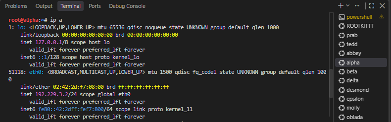

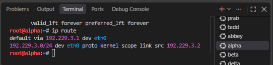

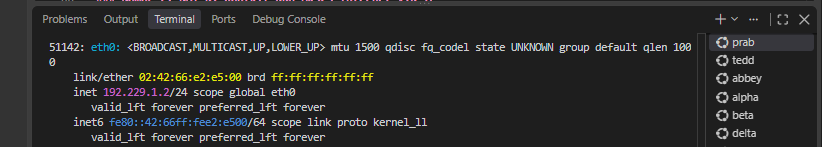

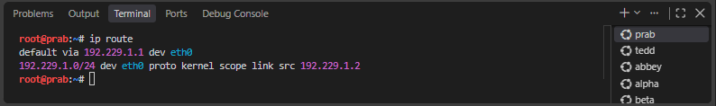

---

### Nomor 2: NAT di Rootkit dan Akses Internet via IP

Aturan MASQUERADE dipasang lewat baris `up iptables ...` di interfaces rootkit, dan IP forwarding diaktifkan lewat sysctl.

Script: `soal1.sh` (baris `up iptables`) dan `soal2.sh` (resolver dan ip_forward, node rootkit).

```sh
up iptables -t nat -A POSTROUTING -o eth0 -j MASQUERADE -s 192.229.0.0/16

cat <<'EOF' > /etc/sysctl.d/99-ip-forward.conf
net.ipv4.ip_forward=1
EOF
sysctl --system
```

Pengujian:

```sh
# di rootkit
iptables -t nat -L POSTROUTING -v -n
# di delta atau tedd
ping 8.8.8.8 -c 4
```

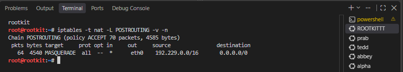

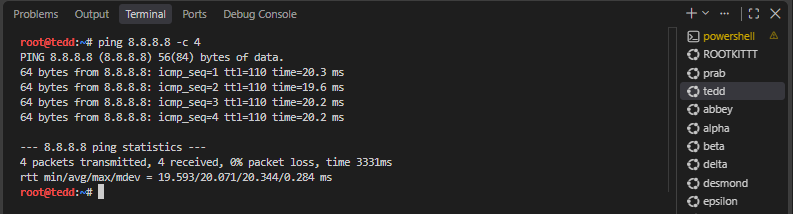

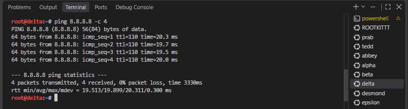

---

### Nomor 3: Routing Internal dan Resolver

Semua node non-router memakai resolver `192.168.122.1` supaya bisa mengunduh paket. Pada script, `/etc/resolv.conf` sudah dalam urutan akhir (prab, tedd, `192.168.122.1`). Routing antar-subnet berjalan lewat gateway rootkit.

Script: `soal3.sh`.

Pengujian dari alpha:

```sh
ping 192.229.1.6 -c 4
cat /etc/resolv.conf
ping google.com -c 4
```

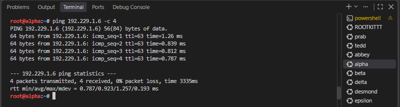

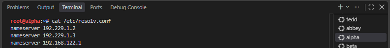

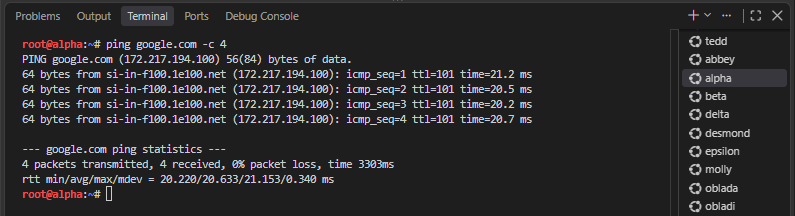

---

### Nomor 4: DNS Authoritative k36.com (Master dan Slave)

Prab menjadi master zona `k36.com` (SOA, NS, A prab dan tedd, A apex ke penny, `allow-transfer` dan `notify` ke tedd, forwarder `192.168.122.1`). Tedd menarik zona sebagai slave.

Script: `soal4.sh prab` dan `soal4.sh tedd`.

```sh
# prab, named.conf.local
zone "k36.com" {
    type master;
    file "/etc/bind/k36/k36.com";
    allow-transfer { 192.229.1.3; };
    notify yes;
};

# tedd, named.conf.local
zone "k36.com" {
    type slave;
    masters { 192.229.1.2; };
    file "/var/lib/bind/k36.com";
};
```

Pengujian dari alpha atau beta:

```sh
dig k36.com @192.229.1.2
dig k36.com @192.229.1.3
```

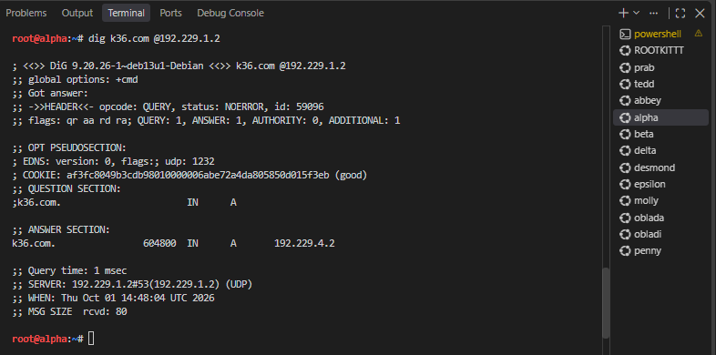

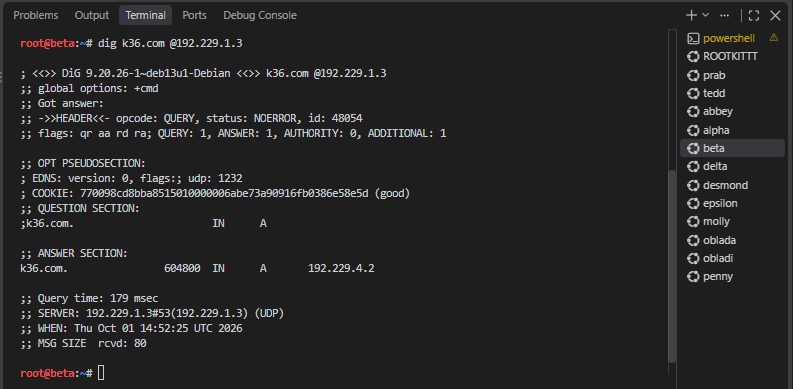

---

### Nomor 5: Hostname dan A Record Tiap Node

Hostname di-set sesuai glosarium (`/etc/hostname`, `hostname`, `/etc/hosts`). A record semua node ditambahkan ke zona di prab.

Script: `soal5.sh`. Hostname dijalankan di tiap node (`bash soal5.sh alpha`, `bash soal5.sh prab`, dan seterusnya), sedangkan A record dijalankan di prab dengan `bash soal5.sh dns`.

```sh
alpha   IN      A       192.229.3.2
beta    IN      A       192.229.3.3
...
molly   IN      A       192.229.1.7
```

Pengujian:

```sh
hostname                 # di alpha/node bebas
dig alpha.k36.com +short # di beta atau gamma
```

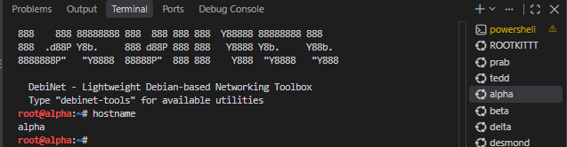

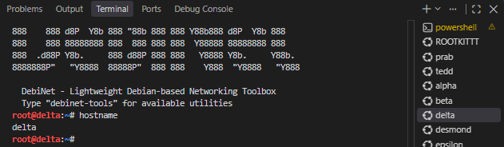

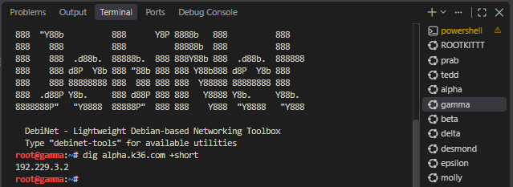

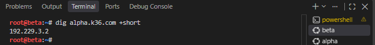

---

### Nomor 6: Sinkronisasi Zona (Serial SOA)

Tedd menerima salinan zona otomatis dari prab lewat zone transfer. Serial SOA di kedua server harus sama.

Script: `soal6.sh` (hanya verifikasi, konfigurasinya dari nomor 4).

```sh
dig SOA k36.com @192.229.1.2 +short
dig SOA k36.com @192.229.1.3 +short
```

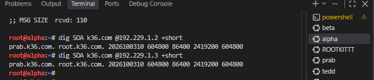

---

### Nomor 7: CNAME www dan static

Zona ditambah A record `vault` (obladi dan desmond), `core` (oblada dan molly), serta CNAME `www` ke penny dan `static` ke abbey.

Script: `soal7.sh` (node prab).

```sh
www     IN      CNAME   penny.k36.com.
static  IN      CNAME   abbey.k36.com.
```

Pengujian:

```sh
dig www.k36.com      # klien 1
dig static.k36.com   # klien 2
```

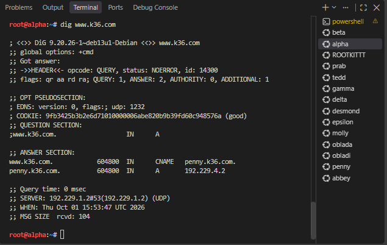.

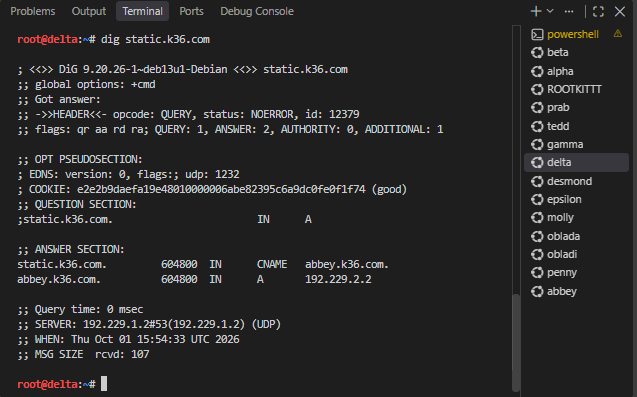

---

### Nomor 8: Reverse Zone (PTR)

Prab mendeklarasikan reverse zone `1.229.192`, `2.229.192`, dan `4.229.192` sebagai master. Tedd menariknya sebagai slave. PTR untuk obladi/desmond (vault), oblada/molly (core), abbey, dan penny sudah diisi.

Script: `soal8.sh prab` dan `soal8.sh tedd`.

Pengujian dari klien:

```sh
dig -x 192.229.1.4 @192.229.1.2
dig -x 192.229.2.2 @192.229.1.3
```

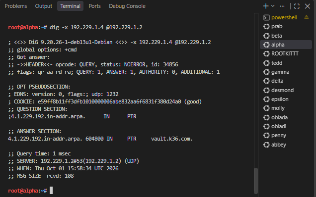

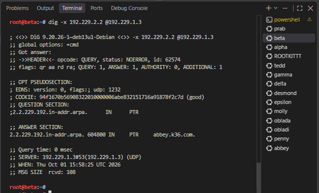

---

### Nomor 9: Web Statis Apache dan Autoindex

Obladi dan desmond menyajikan `/arsip/` lewat Apache dengan `Options +Indexes`. Permission folder diperbaiki (`chmod 755`, `chown www-data`, `Require all granted`) supaya tidak 403.

Script: `soal9.sh obladi` dan `soal9.sh desmond`.

```apache
Alias /arsip /arsip
<Directory /arsip>
    Options +Indexes +FollowSymLinks
    AllowOverride None
    Require all granted
</Directory>
```

Pengujian dari alpha (lewat hostname, bukan IP):

```sh
lynx http://vault.k36.com/arsip/
curl -I http://vault.k36.com/arsip/
curl -s http://vault.k36.com/arsip/ | grep -i "test.txt"
```

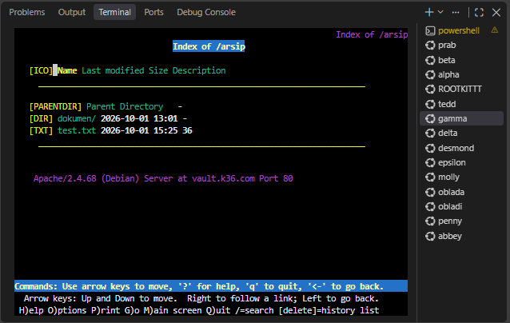

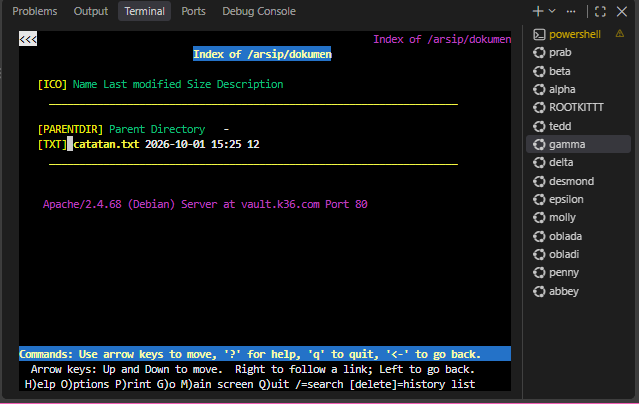

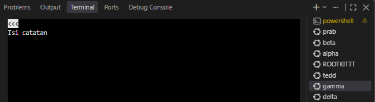

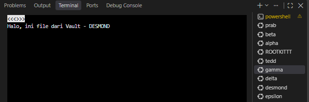

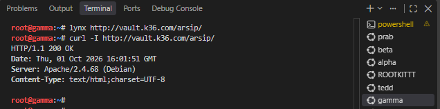

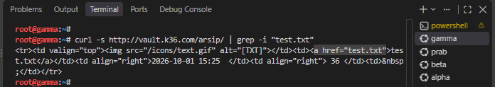

---

### Nomor 10: Web Dinamis (Nginx + PHP-FPM) dan URL Bersih

Oblada dan molly menjalankan Nginx + PHP-FPM dengan halaman beranda (`index.php`) dan profil (`profil.php`). Aturan `rewrite ^/profil$ /profil.php last;` membuat `/profil` bisa diakses tanpa `.php`.

Script: `soal10.sh oblada` dan `soal10.sh molly`.

Pengujian dari klien:

```sh
curl http://core.k36.com/
curl http://core.k36.com/profil
curl -I http://core.k36.com/profil
```

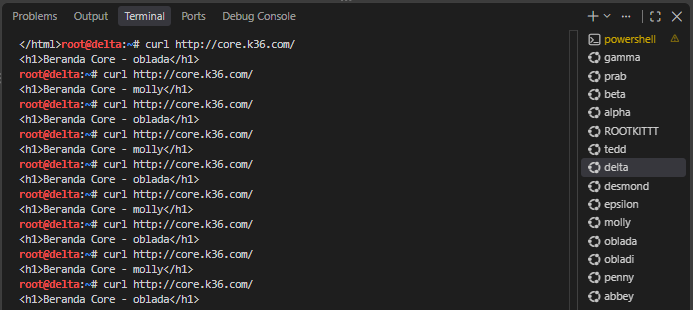

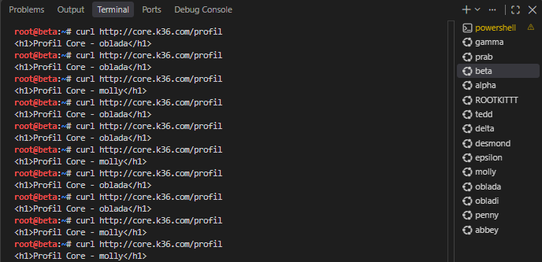

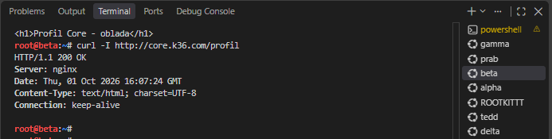

---

### Nomor 11: Reverse Proxy dan Load Balancing

Penny (Apache) memakai `mod_proxy_balancer` ke obladi dan desmond (area vault). Abbey (Nginx) memakai `upstream` ke oblada dan molly (area core). Keduanya meneruskan header `Host` dan `X-Real-IP`.

Script: `soal11.sh penny` dan `soal11.sh abbey`.

```apache
# penny
<Proxy balancer://vaultcluster>
    BalancerMember http://192.229.1.4
    BalancerMember http://192.229.1.5
    ProxySet lbmethod=byrequests
</Proxy>
ProxyPreserveHost On
RequestHeader set X-Real-IP %{REMOTE_ADDR}s
```

```nginx
# abbey
upstream corecluster {
    server 192.229.1.6;
    server 192.229.1.7;
}
proxy_set_header Host $host;
proxy_set_header X-Real-IP $remote_addr;
```

Pengujian dari klien:

```sh
curl http://www.k36.com/arsip/test.txt   # ulang 3x
curl http://static.k36.com/              # ulang 2x
```

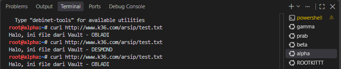

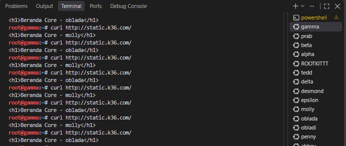

---

### Ringkasan node yang dipakai (12-20)

| Node    | IP          | Peran                                |
| ------- | ----------- | ------------------------------------ |
| alpha   | 192.229.3.2 | Client pengujian                     |
| prab    | 192.229.1.2 | DNS master (ns1)                     |
| tedd    | 192.229.1.3 | DNS slave (ns2)                      |
| obladi  | 192.229.1.4 | Web statis (Apache)                  |
| desmond | 192.229.1.5 | Web statis (Apache)                  |
| oblada  | 192.229.1.6 | Web dinamis (Nginx + PHP-FPM)        |
| molly   | 192.229.1.7 | Web dinamis (Nginx + PHP-FPM)        |
| abbey   | 192.229.2.2 | Reverse proxy (Nginx) ke area core   |
| penny   | 192.229.4.2 | Reverse proxy (Apache) ke area vault |

---

### Nomor 12: Basic Authentication pada `/admin` di Penny

Path `/admin` di penny dilindungi dengan basic authentication. Hanya pengguna `prabs` dengan password dari soal yang boleh masuk.

`/admin` adalah **URL path**, bukan folder di filesystem penny. Penny adalah reverse proxy, jadi request ke `www.k36.com/admin` masuk ke penny lebih dulu sebelum diteruskan ke backend. Karena itu yang dikonfigurasi adalah aturan di Apache penny, bukan folder.

Di penny, instal `apache2-utils` (untuk `htpasswd`) dan buat file password:

```sh
apt install -y apache2-utils

PASS="pakar_pinter_jadi_gob***"
htpasswd -bc /etc/apache2/.htpasswd prabs "$PASS"
```

Lalu tambahkan blok `<Location /admin>` di dalam `<VirtualHost>` pada `/etc/apache2/sites-available/penny-proxy.conf`:

```apache
<Location /admin>
    AuthType Basic
    AuthName "Area Terbatas"
    AuthUserFile /etc/apache2/.htpasswd
    Require valid-user
</Location>
```

Setelah itu cek konfigurasi dan restart Apache:

```sh
apache2ctl configtest
service apache2 restart
```

Pengujian dari alpha:

```sh
curl -i http://www.k36.com/admin/
curl -i -u 'prabs:pakar_pinter_jadi_gob***' http://www.k36.com/admin/
curl -i -u 'prabs:salah' http://www.k36.com/admin/
```


\_Keterangan:\_request tanpa kredensial ditolak dengan status `401 Unauthorized` dan header `WWW-Authenticate: Basic realm="Area Terbatas"`. Ini menunjukkan path `/admin` sudah dilindungi.Sedangkan, dengan user `prabs` dan password yang benar, status tidak lagi 401. Hasilnya `404 Not Found` yang berasal dari backend, karena folder `admin` memang belum ada di obladi dan desmond. Status ini tetap membuktikan autentikasi di penny sudah lolos.

---

### Nomor 13: Redirect ke Hostname Kanonik

Akses lewat nama selain nama kanonik harus dialihkan.

| Gerbang | Diakses lewat                        | Redirect        | Tujuan           |
| ------- | ------------------------------------ | --------------- | ---------------- |
| penny   | IP `192.229.4.2` dan `penny.k36.com` | 301 (permanen)  | `www.k36.com`    |
| abbey   | IP `192.229.2.2` dan `abbey.k36.com` | 302 (sementara) | `static.k36.com` |

Server memilih virtual host berdasarkan header `Host`. Karena itu dibuat satu virtual host khusus yang menangkap nama non-kanonik dan isinya hanya redirect, sementara virtual host `www` dan `static` tetap melayani konten.

**Penny (Apache).** Buat `/etc/apache2/sites-available/000-redirect.conf`:

```apache
<VirtualHost *:80>
    ServerName penny.k36.com
    ServerAlias 192.229.4.2
    Redirect permanent / http://www.k36.com/
</VirtualHost>
```

```sh
a2ensite 000-redirect.conf
apache2ctl configtest
service apache2 restart
```

Nama file diawali `000-` supaya terbaca lebih dulu daripada `penny-proxy.conf`. Apache memakai virtual host pertama sebagai default untuk Host yang tidak cocok, sehingga request lewat IP jatuh ke virtual host redirect.

**Abbey (Nginx).** Pada `/etc/nginx/sites-available/abbey-proxy`, blok redirect dibuat terpisah dari blok proxy:

```nginx
upstream corecluster {
    server 192.229.1.6;
    server 192.229.1.7;
}

# Nomor 11: reverse proxy ke area core
server {
    listen 80;
    server_name static.k36.com;

    location / {
        proxy_pass http://corecluster;
        proxy_set_header Host $host;
        proxy_set_header X-Real-IP $remote_addr;
    }
}

# Nomor 13: redirect 302 dari nama non-kanonik
server {
    listen 80;
    server_name abbey.k36.com 192.229.2.2;
    return 302 http://static.k36.com$request_uri;
}
```

```sh
nginx -t
service nginx restart
```

Kedua blok harus dipisah. Jika `return 302` diletakkan di server block yang sama dengan `server_name static.k36.com`, redirect akan terjadi untuk semua request termasuk ke `static.k36.com` dan menyebabkan redirect loop.

Pengujian dari alpha:

```sh
curl -I http://192.229.4.2
curl -I http://penny.k36.com
curl -IL http://penny.k36.com
curl -I http://192.229.2.2
curl -I http://abbey.k36.com
curl -IL http://abbey.k36.com
curl -I http://www.k36.com
curl -I http://static.k36.com
```

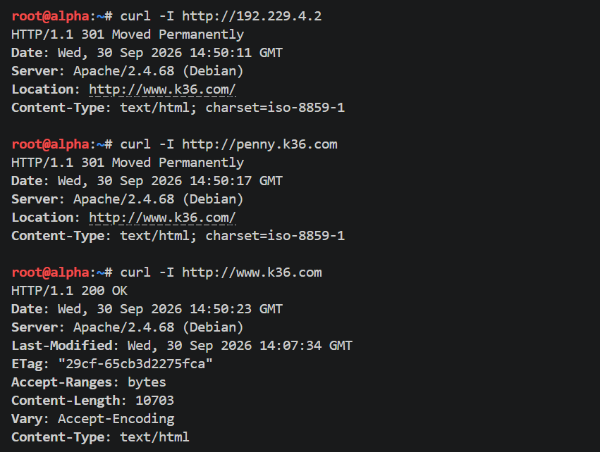

_Keterangan:_ akses lewat IP penny dan `penny.k36.com` menghasilkan `301 Moved Permanently` dengan `Location: http://www.k36.com/`. Akses ke `www.k36.com` tetap `200 OK`.

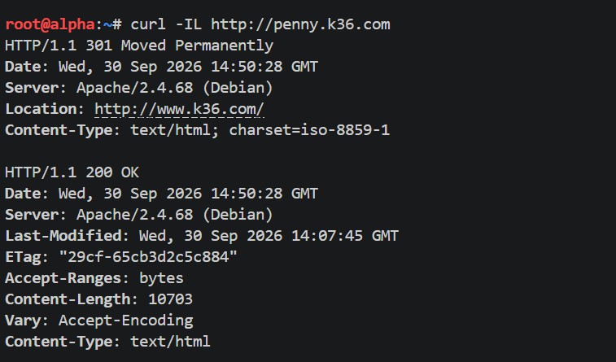

_Keterangan:_ dengan `curl -IL`, tampil dua blok respons. Blok pertama `301` dari penny, blok kedua `200 OK` dari `www.k36.com`. Ini membuktikan redirect sampai ke tujuan yang benar.

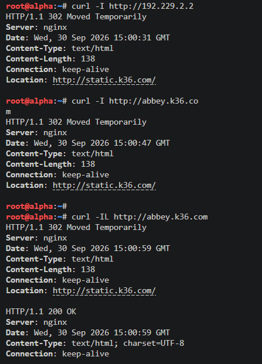

_Keterangan:_ akses lewat IP abbey dan `abbey.k36.com` menghasilkan `302 Moved Temporarily` dengan `Location: http://static.k36.com/`. Pada `curl -IL`, respons `302` diikuti `200 OK`.

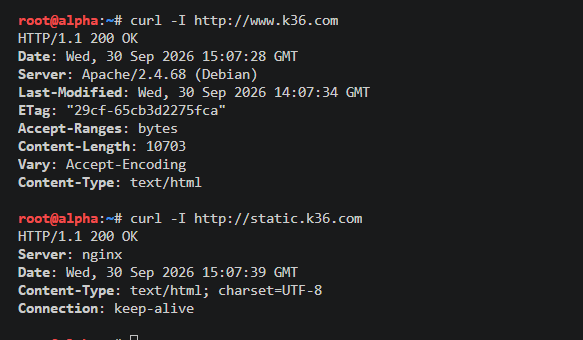

_Keterangan:_ `www.k36.com` (dilayani Apache) dan `static.k36.com` (dilayani Nginx) sama-sama `200 OK` tanpa header `Location`, jadi nama kanonik tidak ikut dialihkan.

---

### Nomor 14: Access Log Mencatat IP Asli Client

Backend harus mencatat IP asli pengunjung yang diteruskan gerbang, bukan IP penny atau abbey.

**Area vault (obladi dan desmond, Apache).** Aktifkan modul `remoteip` dan percayai penny sebagai proxy:

```sh
a2enmod remoteip

cat <<'EOF' > /etc/apache2/conf-available/remoteip.conf
RemoteIPHeader X-Forwarded-For
RemoteIPInternalProxy 192.229.4.2
EOF

a2enconf remoteip
```

Pastikan virtual host mencatat ke `access.log`:

```apache
CustomLog ${APACHE_LOG_DIR}/access.log combined
```

`RemoteIPInternalProxy` membatasi kepercayaan hanya pada penny, supaya header tidak bisa dipalsukan oleh pihak lain. Format log `combined` memakai `%h`, dan modul `remoteip` mengganti nilainya dengan IP dari header.

**Area core (oblada dan molly, Nginx).** Tambahkan di dalam server block:

```nginx
set_real_ip_from 192.229.2.2;
real_ip_header X-Real-IP;
```

`set_real_ip_from` menentukan proxy yang dipercaya (abbey) dan `real_ip_header` menentukan header yang dibaca. Setelah itu `$remote_addr` berisi IP client.

Pengujian dari alpha:

```sh
# Apache (vault)
for i in 1 2 3 4 5 6; do curl -s -o /dev/null http://www.k36.com/; done

# Nginx (core)
for i in 1 2 3 4 5 6; do curl -s -o /dev/null http://static.k36.com/; done
```

Lalu cek log di backend:

```sh
tail -n 3 /var/log/apache2/access.log   # obladi dan desmond
tail -n 5 /var/log/nginx/access.log     # oblada dan molly
```

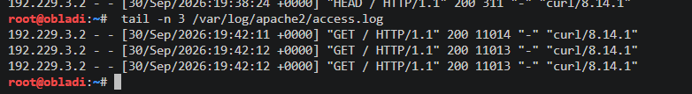

_Keterangan:_ log Apache di obladi. Kolom pertama berisi `192.229.3.2` (IP alpha), bukan `192.229.4.2` (IP penny).

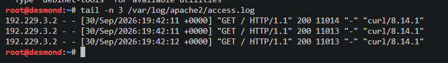

_Keterangan:_ log Apache di desmond. IP yang tercatat juga `192.229.3.2`. Karena obladi dan desmond sama-sama menerima request, terbukti penny membagi trafik ke keduanya.

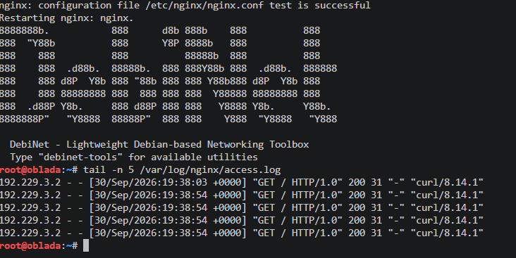

_Keterangan:_ log Nginx di oblada. IP yang tercatat `192.229.3.2` (alpha), bukan `192.229.2.2` (abbey). Versi `HTTP/1.0` muncul karena `proxy_pass` Nginx ke backend tanpa keepalive.

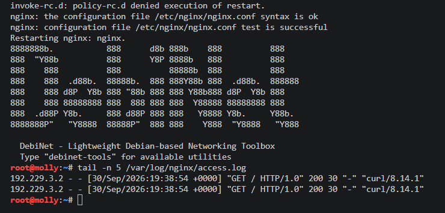

_Keterangan:_ log Nginx di molly. IP yang tercatat juga `192.229.3.2`, jadi kedua backend core mencatat IP client asli.

---

### Nomor 15: Jalur Proxy Khusus `/eternal` dan `/orion`

| Gerbang | Path       | Direktori          | PHP                       |
| ------- | ---------- | ------------------ | ------------------------- |
| penny   | `/eternal` | `/var/www/eternal` | Dieksekusi                |
| abbey   | `/orion`   | `/var/www/orion`   | Tidak dieksekusi (statis) |

**Penny (Apache).** Instal modul PHP, lalu sajikan `/var/www/eternal` lewat virtual host di port 8081 dan proxy-kan path `/eternal` ke sana:

```sh
apt install -y libapache2-mod-php

mkdir -p /var/www/eternal
cat <<'EOF' > /var/www/eternal/index.php
<?php
echo "Eternal dari penny, PHP " . phpversion();
?>
EOF

grep -q "Listen 8081" /etc/apache2/ports.conf || echo "Listen 8081" >> /etc/apache2/ports.conf

cat <<'EOF' > /etc/apache2/sites-available/eternal.conf
<VirtualHost *:8081>
    DocumentRoot /var/www/eternal
</VirtualHost>
EOF

a2ensite eternal.conf
```

Di `penny-proxy.conf`, tambahkan dua baris `/eternal` **di atas** `ProxyPass /`:

```apache
# Nomor 15
ProxyPass /eternal http://127.0.0.1:8081
ProxyPassReverse /eternal http://127.0.0.1:8081

ProxyPass / balancer://vaultcluster/
ProxyPassReverse / balancer://vaultcluster/
```

Urutan ini penting karena Apache memakai `ProxyPass` pertama yang cocok. Jika `/eternal` diletakkan setelah `/`, semua request tetap lari ke vault.

**Abbey (Nginx).** Buat folder dan file uji, lalu tambahkan blok `location` di dalam server block `static.k36.com`:

```sh
mkdir -p /var/www/orion
echo "Orion dari abbey" > /var/www/orion/index.html
echo '<?php echo "x"; ?>' > /var/www/orion/test.php
```

```nginx
# Nomor 15
location = /orion {
    return 301 /orion/;
}

location /orion/ {
    alias /var/www/orion/;
}
```

Tidak ada `fastcgi_pass` pada blok ini, sehingga file PHP tidak dieksekusi. File `test.php` dibuat khusus sebagai pembuktian bahwa jalur ini murni statis.

Pengujian dari alpha:

```sh
curl http://www.k36.com/eternal/
curl http://static.k36.com/orion/
curl http://static.k36.com/orion/test.php
curl -I http://www.k36.com/
```

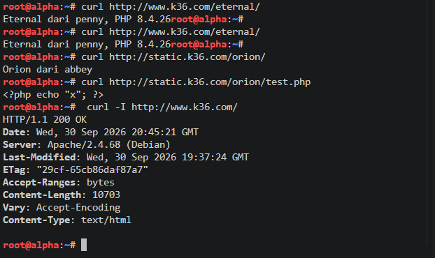

_Keterangan:_ `/eternal/` menampilkan `Eternal dari penny, PHP 8.4.26`, artinya penny yang menjawab dan kode PHP dieksekusi. `/orion/` menampilkan `Orion dari abbey`. `/orion/test.php` menampilkan kode mentah `<?php echo "x"; ?>`, artinya tidak ada eksekusi PHP di jalur statis. `www.k36.com` tetap `200 OK`, jadi path lain tidak terganggu.

---

### Nomor 16: Stress Test dengan ApacheBench

Pengujian dilakukan dari alpha dengan 250 request dan concurrency 10 ke `www.k36.com` dan `static.k36.com`.

```sh
apt update
apt install -y apache2-utils

ab -n 250 -c 10 http://www.k36.com/
ab -n 250 -c 10 http://static.k36.com/
```


_Keterangan:_ hasil benchmark `www.k36.com` (penny, Apache, ke vault). Seluruh 250 request selesai tanpa kegagalan.


_Keterangan:_ hasil benchmark `static.k36.com` (abbey, Nginx, ke core). Seluruh 250 request selesai.

Rangkuman hasil:

| Metrik                  | www.k36.com   | static.k36.com          |
| ----------------------- | ------------- | ----------------------- |
| Server software         | Apache/2.4.68 | nginx                   |
| Document length         | 10703 bytes   | 31 bytes                |
| Complete requests       | 250           | 250                     |
| Time taken for tests    | 0,142 detik   | 0,100 detik             |
| Requests per second     | 1758,87       | 2497,83                 |
| Time per request (mean) | 5,685 ms      | 4,003 ms                |
| Transfer rate           | 18854,57 KB/s | 391,51 KB/s             |
| Longest request         | 10 ms         | 9 ms                    |
| Failed requests         | 0             | 124 (hanya tipe Length) |

Pada `static.k36.com`, 124 request dilaporkan sebagai failed dengan rincian `Length: 124`, dan tidak ada `Non-2xx responses`. Artinya semua request tetap dijawab `200`. ApacheBench menganggap request gagal jika panjang isinya berbeda dari respons pertama. Oblada mengirim 31 byte dan molly 30 byte, sehingga respons dari salah satunya dihitung sebagai selisih panjang. Angka ini sekaligus menunjukkan trafik terbagi hampir rata ke dua backend.

`static.k36.com` terlihat lebih cepat terutama karena halaman yang dilayani jauh lebih kecil (31 byte dibanding 10703 byte), bukan semata karena perbedaan Nginx dan Apache.

---

### Nomor 17: TXT Record untuk Client

Tambahkan TXT record untuk alpha, beta, gamma, delta, dan epsilon. Query TXT ke nama domain mereka harus mengembalikan nama hostname masing-masing.

Di prab, pada file zona `/etc/bind/k36/k36.com`, tambahkan:

```
alpha   IN      TXT     "alpha"
beta    IN      TXT     "beta"
gamma   IN      TXT     "gamma"
delta   IN      TXT     "delta"
epsilon IN      TXT     "epsilon"
```

Serial SOA harus dinaikkan (misalnya menjadi `2026100101`) supaya tedd menarik zona yang baru. Tedd sebagai slave menyalin semua record secara otomatis lewat zone transfer, sehingga TXT tidak perlu ditulis lagi di tedd.

Catatan penulisan: pada file zona BIND, komentar memakai `;`, bukan `#`.

Pengujian dari alpha:

```sh
dig @192.229.1.2 alpha.k36.com TXT
dig @192.229.1.3 beta.k36.com TXT
dig +short @192.229.1.2 k36.com SOA
dig +short @192.229.1.3 k36.com SOA
for h in alpha beta gamma delta epsilon; do echo -n "$h -> "; dig +short $h.k36.com TXT; done
```


_Keterangan:_ isi file zona di prab (`grep TXT /etc/bind/k36/k36.com`) menampilkan lima TXT record untuk alpha sampai epsilon.

.png>)

_Keterangan:_ `dig` TXT ke prab untuk `alpha.k36.com` dan `beta.k36.com`. Statusnya `NOERROR`, ada flag `aa` (authoritative), dan `ANSWER SECTION` berisi `"alpha"` dan `"beta"`.

.png>)

_Keterangan:_ `dig` TXT ke tedd untuk `beta.k36.com` juga menjawab `"beta"` dengan flag `aa`. Ini menunjukkan tedd sudah menarik zona dari prab.

.png>)

_Keterangan:_ serial SOA di prab dan tedd sama (`2026100101`). Loop untuk kelima client mengembalikan `"alpha"`, `"beta"`, `"gamma"`, `"delta"`, dan `"epsilon"`, sesuai hostname masing-masing.

---

### Nomor 18: Perubahan A Record dan Pengaruh TTL

Soal meminta A record `abbey.k36.com` diubah ke IP fiktif dengan TTL 15 detik, lalu diamati tiga fase: sebelum perubahan (IP lama), sesaat setelah perubahan (masih IP lama karena cache), dan setelah TTL habis (IP baru).

Server prab dan tedd bersifat authoritative sehingga tidak menyimpan cache untuk zonanya sendiri. Supaya efek cache terlihat, alpha diberi resolver BIND lokal (caching resolver) yang meneruskan query ke prab, lalu `dig` diarahkan ke `127.0.0.1`.

Script ini hanya alat bantu untuk pengujian dan tidak dimasukkan ke `init.sh`, karena soal 20 meminta konfigurasi nomor 18 diabaikan setelah node di-restart.

**Di prab: `/root/soal18.sh`** (serial dihitung otomatis dari serial yang sedang aktif)

```sh
cat <<'EOF' > /root/soal18.sh
#!/bin/bash
ZONE=/etc/bind/k36/k36.com

serial() { grep -m1 -oE '\( *[0-9]+' $ZONE | grep -oE '[0-9]+'; }
setserial() { sed -E -i "/SOA/ s/\( *[0-9]+ /( $1 /" $ZONE; }
reload() {
  named-checkzone k36.com $ZONE > /dev/null || { echo "Zona error, dihentikan"; exit 1; }
  service named restart > /dev/null
}

NEW=$(( $(serial) + 1 ))

case "$1" in
  ttl)
    sed -E -i "s/^abbey[[:space:]].*/abbey   15   IN   A   192.229.2.2/" $ZONE
    setserial $NEW
    reload
    echo "TTL 15 aktif, serial $NEW"
    ;;
  swap)
    echo "Tukar IP jam: $(date +%T)"
    sed -E -i "s/^abbey[[:space:]].*/abbey   15   IN   A   10.77.77.77/" $ZONE
    setserial $NEW
    reload
    echo "IP fiktif aktif, serial $NEW"
    ;;
  restore)
    sed -E -i "s/^abbey[[:space:]].*/abbey   IN      A       192.229.2.2/" $ZONE
    setserial $NEW
    reload
    sed -E -i "s/\( *20261[0-9]+ /( $NEW /" /root/init.sh
    echo "Kembali normal, serial $NEW (init.sh disamakan)"
    ;;
  *)
    echo "Pakai: bash /root/soal18.sh ttl|swap|restore"
    ;;
esac
EOF
```

**Di alpha: `/root/18.sh`** (caching resolver)

```sh
export DEBIAN_FRONTEND=noninteractive
apt update && apt install -y bind9 bind9-utils

cat <<'EOF' > /etc/bind/named.conf.options
options {
    directory "/var/cache/bind";
    forwarders { 192.229.1.2; };
    forward only;
    dnssec-validation no;
    listen-on { 127.0.0.1; };
    allow-query { localhost; };
};
EOF

service named restart
dig +noall +answer @127.0.0.1 abbey.k36.com
```

**Langkah pengujian**

1. Di prab: `bash /root/soal18.sh ttl` (pasang TTL 15 pada record abbey).
2. Di alpha, pastikan resolver aktif, lalu jalankan loop:

```sh
   rndc flush; for i in $(seq 1 15); do echo -n "$(date +%T)  "; dig +noall +answer @127.0.0.1 abbey.k36.com; sleep 3; done
```

3. Saat loop berjalan, di prab: `bash /root/soal18.sh swap` (ganti IP abbey ke `10.77.77.77`).
4. Cek tedd ikut berubah:

```sh
   dig +short @192.229.1.2 k36.com SOA
   dig +short @192.229.1.3 k36.com SOA
   dig +noall +answer @192.229.1.3 abbey.k36.com
   dig +noall +answer @192.229.1.2 abbey.k36.com
```

5. Di prab: `bash /root/soal18.sh restore` (kembalikan IP abbey ke `192.229.2.2`).
   

_Keterangan:_ output `soal18.sh swap` di prab. Perubahan dilakukan pada jam `10:17:03` dan serial zona naik menjadi `2026100301`.


_Keterangan:_ output loop di alpha. Timeline-nya sebagai berikut.

| Jam                      | Jawaban                               | Fase                               |
| ------------------------ | ------------------------------------- | ---------------------------------- |
| 10:16:53 sampai 10:17:02 | `192.229.2.2`, TTL turun 15, 12, 9, 6 | Fase 1, sebelum perubahan          |
| 10:17:03                 | Zona di prab ditukar                  | Perubahan terjadi                  |
| 10:17:05                 | `192.229.2.2`, TTL sisa 3             | Fase 2, masih IP lama karena cache |
| 10:17:08                 | `10.77.77.77`, TTL kembali 15         | Fase 3, cache habis, IP baru       |

TTL yang menghitung mundur pada jawaban lama menunjukkan jawaban diambil dari cache resolver di alpha, bukan dari prab. Setelah TTL habis, resolver bertanya ulang ke prab dan mendapat IP baru. Pada bagian akhir screenshot, serial SOA prab dan tedd sama (`2026100301`) dan keduanya menjawab `10.77.77.77`, sehingga tedd ikut tersinkron.

Setelah `restore`, abbey kembali ke `192.229.2.2` dengan TTL bawaan (`604800`) dan serial prab dan tedd harus sama.

---

### Nomor 19: CNAME ke Domain Eksternal

Buat CNAME `outbound.k36.com` yang menunjuk ke domain eksternal `http.badssl.com`.

Karena `http.badssl.com` berada di luar zona `k36.com`, prab dan tedd harus mau mengejar targetnya lewat forwarder supaya jawaban sampai ke IP. Tambahkan di `named.conf.options` pada **prab dan tedd**:

```
allow-recursion { any; };
allow-query { any; };
```

Di prab, tambahkan pada file zona `k36.com`:

```
outbound   IN   CNAME   http.badssl.com.
```

Titik di akhir `http.badssl.com.` wajib ada. Tanpa titik, BIND menempelkan `k36.com` di belakangnya dan hasilnya menjadi `http.badssl.com.k36.com`. Serial SOA dinaikkan supaya tedd menarik zona terbaru.

Pengujian dari alpha:

```sh
dig outbound.k36.com
dig @192.229.1.3 outbound.k36.com
dig +short @192.229.1.2 k36.com SOA
dig +short @192.229.1.3 k36.com SOA
curl -i http://http.badssl.com
curl -i -H "Host: http.badssl.com" http://outbound.k36.com
```


_Keterangan:_ `dig outbound.k36.com` ke prab dan tedd menampilkan `outbound.k36.com. CNAME http.badssl.com.` diikuti A record `104.154.89.105`, dengan flag `aa` di keduanya. Adanya baris A menunjukkan recursion berjalan.


_Keterangan:_ serial SOA di prab dan tedd sama, jadi CNAME sudah tersinkron ke tedd.


_Keterangan:_ `curl http://http.badssl.com` dan `curl -H "Host: http.badssl.com" http://outbound.k36.com` menghasilkan respons identik (`Content-Length: 483`, `ETag: "6abc274f-1e3"`, halaman `http.badssl.com`). Ini membuktikan CNAME mengarah ke server yang benar.

Catatan: `curl` tanpa header `Host` ke `outbound.k36.com` mengirim `Host: outbound.k36.com`, dan server badssl yang melayani banyak situs menjawab dengan halaman default nginx. Hal itu terjadi di sisi server tujuan, sedangkan resolusi DNS-nya sudah benar.

---

### Nomor 20: Service dan Konfigurasi Tetap Berjalan Setelah Restart

Semua service dan konfigurasi harus tetap berjalan dan autostart saat node di-restart. Konfigurasi nomor 18 diabaikan, sehingga abbey kembali ke IP aslinya.

Container tidak memiliki systemd, jadi service tidak menyala sendiri. Mekanisme yang dipakai adalah script `/root/init.sh` pada setiap node. Script ini dijalankan otomatis saat node start, menginstal paket, menulis ulang konfigurasi, lalu menyalakan service.

Hal-hal yang dipastikan pada `init.sh`:

- Instalasi memakai `export DEBIAN_FRONTEND=noninteractive` dan `-o Dpkg::Options::="--force-confold"` agar script tidak berhenti di prompt dpkg.
- Nama service BIND di Debian adalah `named`, sehingga baris penutup memakai `service named restart`.
- Setiap heredoc ditutup dengan `EOF`, dan komentar di dalam file zona memakai `;`.
- Serial SOA di `init.sh` prab sama dengan serial yang sedang aktif. Mode `restore` pada `soal18.sh` menyamakan nilai ini, supaya tedd tidak menolak zona yang serialnya lebih rendah setelah prab restart.
- Konfigurasi soal 12 sampai 19 (auth `/admin`, redirect, `remoteip` dan `real_ip`, `/eternal`, `/orion`, TXT, `outbound`, recursion) semuanya ada di `init.sh` node masing-masing.
  Setelah semua node di-restart tanpa perintah manual, pengujian dijalankan dari alpha dengan `/root/soal20.sh`:

```sh
#!/bin/bash
echo "== Soal 2: internet via IP =="
ping -c 2 8.8.8.8

echo "== DNS: prab dan tedd =="
for s in 192.229.1.2 192.229.1.3; do
  echo "-- $s"
  dig +short @$s k36.com SOA
  dig +short @$s www.k36.com
  dig +short @$s alpha.k36.com TXT
  dig +short @$s -x 192.229.1.4
  dig +short @$s outbound.k36.com
  dig +noall +answer @$s abbey.k36.com
done

echo "== Soal 13: redirect =="
for u in 192.229.4.2 penny.k36.com 192.229.2.2 abbey.k36.com www.k36.com static.k36.com; do
  echo -n "$u -> "
  curl -s -o /dev/null -w "%{http_code} %{redirect_url}\n" http://$u
done

echo "== Soal 9 dan 10: backend lewat hostname =="
curl -s -o /dev/null -w "vault arsip: %{http_code}\n" http://vault.k36.com/arsip/
curl -s -o /dev/null -w "core profil: %{http_code}\n" http://core.k36.com/profil

echo "== Soal 11: distribusi trafik =="
for i in 1 2 3 4; do curl -s http://www.k36.com/ | head -c 60; echo; done

echo "== Soal 12: admin =="
curl -s -o /dev/null -w "tanpa kredensial: %{http_code}\n" http://www.k36.com/admin/
curl -s -o /dev/null -w "dengan kredensial: %{http_code}\n" -u 'prabs:pakar_pinter_jadi_gob***' http://www.k36.com/admin/

echo "== Soal 15 =="
curl -s http://www.k36.com/eternal/; echo
curl -s http://static.k36.com/orion/
```


Hasil ini menunjukkan seluruh service dan konfigurasi tetap berjalan setelah node di-restart, dan konfigurasi nomor 18 sudah kembali normal.
